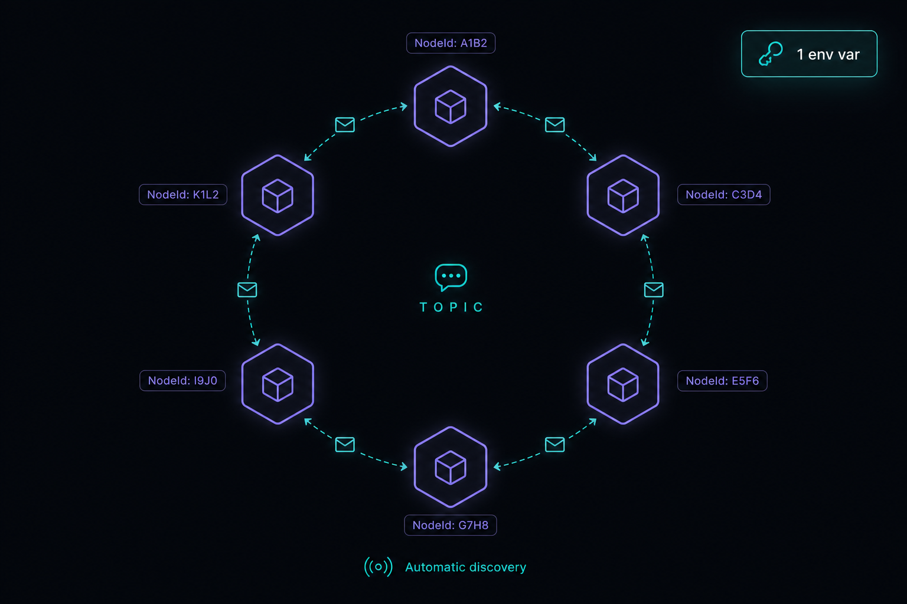

# CozyPlan — HTML-First Planning for Agentic Engineering

> **A [Mythos-class](https://www.anthropic.com/news/claude-fable-5-mythos-5) planning plugin: two skills that interrogate, write, build, and maintain every plan your agents run — and keep the "why" alive after everyone moves on.**
> Built for the agent trifecta: you, your team, and your AI agents.

<p align="center">
  
</p>

Most engineers hand planning to the model and hope. `/plan` goes into a black box, something comes out, and you review whatever you get. CozyPlan inverts that: you template your engineering once (the exact sections, the exact loops, the exact visual identity), and every plan the agent writes mirrors it, forever.

The big unlock is the new Mythos-class models (Fable 5 and what follows). They raise the intelligence ceiling far enough to absorb a token-rich, HTML-first plan and hit the *exact* outcomes you specify, which is the next level of planning ability we've been waiting for. CozyPlan was built to pull that capability out of them: it deliberately spends tokens, images, and structure to extract the best plan these models can produce. Every property in the skill exists to capture that ceiling, and the payoff compounds with each more-capable model. **Great planning is great engineering, and this is the skill that encodes yours.**

---

## Install

CozyPlan ships as a **Claude Code plugin**. Installing it is two commands — nothing to compile, no API key to wire, and no files to hand-copy into each project:

```
/plugin marketplace add https://github.com/smcozart/cozyplan.git
/plugin install cozyplan@cozyplan
```

The first command registers this repo as a plugin marketplace; the second installs the `cozyplan` plugin from it. The plugin carries everything as one unit — **two skills** (`cozyplan`, the plan layer, and `discuss`, the understanding loop — each with its own workflows and templates), the deterministic `plan_tool.py` CLI, and the two coherence hooks. Once it's installed, both skills work in every project your harness opens; there's no per-project setup.

**Prerequisite: [`uv`](https://docs.astral.sh/uv/) on your `PATH`.** The CLI and both hooks run through `uv run`. If `uv` isn't found the hooks **fail open** — they exit quietly instead of blocking, so the guard that steers raw edits back through `plan_tool` and the lint that validates every plan write both silently stop enforcing. Plans still get written, but nothing is catching drift or malformed HTML for you. Install `uv` first, or accept that plan coherence is on the honor system — there's no error to warn you it lapsed.

Diagrams are the plugin's one external dependency: the globally-installed [`excalidraw-diagram`](#the-workflows) skill renders them locally, key-free. Without it a plan still writes; the `{{...IMAGE}}` slots stay as placeholders until you run the Diagram Generation subworkflow with the skill present.

### Or: install as bare skills (npx)

The repo is also a valid source for the [`skills` CLI](https://github.com/vercel-labs/skills) — both skill directories are fully self-contained (the `plan_tool.py` CLI and both hook scripts ship inside `skills/cozyplan/scripts/`, so they travel with the skill):

```
npx skills add smcozart/cozyplan
```

Select `cozyplan` (and `discuss` — recommended; it's the interview/context half) plus your agent, and the skills install into `.claude/skills/` (`-g` for global). Two differences from the plugin install: the coherence hooks are **not** auto-registered — every `plan_tool` op still self-validates, and the skill will offer to wire the hooks into `.claude/settings.json` if you ask — and updates come from `npx skills update` instead of the plugin marketplace.

### Migrating from the copy-install

Earlier versions of CozyPlan were installed by hand-copying the skill and merging hooks into each project. If you did that, undo it when you move to the plugin — otherwise the skill and the hooks each register **twice**:

- **Delete any hand-copied skill.** Remove `.claude/skills/cozyplan` from any project you copied it into (and `~/.claude/skills/cozyplan` if you installed it globally). The plugin now supplies the skill; a leftover copy shadows it.
- **Remove the two CozyPlan hook entries** — the `guard_plan_edit.py` PreToolUse block and the `lint_plan.py` PostToolUse block — from any project-local `.claude/settings.json`. The plugin registers these hooks itself, so a project-local copy makes each hook fire twice (plugin + project) on every write.

To surface open decisions in a toggleable Q&A section instead of silently
deciding, ask for it in the prompt (e.g. "…and flag the open questions").

---

## Why this exists

<p align="center">
  
</p>

There are two hard constraints in agentic engineering: **planning** and **reviewing**. Most engineers spend their effort on the second one: babysitting output, catching drift, re-prompting. That's backwards. A vague `/plan` forces the model to guess what you want; you pay for the guess on every review pass that follows. The upfront plan is the cheapest place to buy correctness.

<p align="center">
  
</p>

CozyPlan is a **meta-skill**, a skill that produces other artifacts. You write the plan *format* once, and the agent reproduces it across hundreds of executions: same sections, same checklists, same validation loops, same look. That consistency is you teaching the agent *how you engineer*. **More upfront investment in the plan means less reviewing later, and the gap widens with every more-capable model.**

---

## How it works

CozyPlan takes a prompt and emits a single self-contained `.html` plan into `specs/`. HTML-first is a deliberate trade: it costs more tokens than markdown, and it buys a plan that opens in a browser, embeds synced diagrams, and reads cleanly for all three audiences. Of the trade-off trifecta (performance, speed, cost) this skill spends speed and cost to maximize performance.

The skill's API is one line:

```
/cozyplan "<user prompt>" [questionable]
```

| Input | Meaning |
|---|---|
| `USER_PROMPT` | What to plan, build, update, or illustrate — this also selects the workflow |
| `QUESTIONABLE` | `true` surfaces assumptions in a toggleable Q&A section; defaults to `false` |

On a create run the agent reads the prompt, explores the codebase (plus `AI_DOCS/` and `APP_DOCS/` if present), authors the HTML plan from the template, generates one Excalidraw diagram per section (authored one at a time, rendered locally), validates and indexes the plan via `plan_tool.py`, and opens the result in your default browser.

---

## The plan template

<p align="center">
  
</p>

The heart of the skill is the **Plan Template** in [`SKILL.md`](skills/cozyplan/SKILL.md): the structure the agent mirrors every time. `{{PLACEHOLDER}}` tokens get replaced with real content; `<!-- repeat -->` blocks duplicate per phase, task, or file. Every plan carries:

| Section | What it gives the trifecta |
|---|---|
| **Updatable metadata** | write-once `id` and `created`; single-value `owner` (role) and `status`; append-only lists of `modified`, `commits`, `agent`, `session`, and back/forward references — the plan is a living artifact |
| **Purpose / Problem / Solution** | The why, the pain, the approach — each with a focused diagram |
| **Relevant Files** | Existing files (tagged) vs new files, so the builder knows the blast radius |
| **Implementation Phases** | Phased work, each phase carrying per-task checklists and a Testing Strategy |
| **Validation loop** | A closed loop — *do not exit until every box is `[x]` or `[f]` and every command passes* |
| **Notes** | Open canvas where the planning agent runs free — matrices, tradeoffs, rejected approaches |
| **Amendments** | Append-only history of changes made *after* the plan was first built |

Status markers (`[]` idle · `[wip]` in progress · `[x]` complete · `[f]` failed) live right in the checklist, so the build agent tracks its own progress inside the plan itself. `[f]` is terminal — it means a box genuinely can't be made to pass, and it carries a one-line reason. The metadata, status markers, and amendments are **CLI-managed regions** (marked `data-managed="cli"`): they are written through `plan_tool.py`, never hand-edited. See [Keeping plans consistent](#keeping-plans-consistent).

---

## The workflows

<p align="center">
  
</p>

CozyPlan is one skill, but the prompt routes to one of **five dedicated workflows**, backed by **one subworkflow** for diagrams. This keeps the plan a living artifact across the whole lifecycle of the codebase, not a write-once document.

| Workflow | Trigger | File |
|---|---|---|
| **Create Plan** | Plan/spec/design new work, no existing plan referenced — **step 1 runs the `discuss` skill's interview by default** (skip by saying so) | [`create-plan.md`](skills/cozyplan/workflows/create-plan.md) |
| **Update Plan** | Change, extend, or revise an existing plan (surgical edit + amendment); offers a discuss pass for structural revisions | [`update-plan.md`](skills/cozyplan/workflows/update-plan.md) |
| **Update References** | Refresh metadata or wire bidirectional back/forward references | [`update-references.md`](skills/cozyplan/workflows/update-references.md) |
| **Build Plan** | Implement the work in an existing plan, updating status markers as it goes | [`build-plan.md`](skills/cozyplan/workflows/build-plan.md) |
| **Generate Roles** | Scope a whole project/team into roles and set up who-owns-what (not a single plan) | [`generate-roles.md`](skills/cozyplan/workflows/generate-roles.md) |

| Subworkflow | Called by | File |
|---|---|---|
| **Diagram Generation** | Other workflows (e.g. Create Plan) — authors and renders the embedded Excalidraw diagrams locally via the `excalidraw-diagram` skill (no API key) | [`diagram-generation.md`](skills/cozyplan/workflows/diagram-generation.md) |

The **Build Plan** workflow is the payoff: a fresh agent reads the full plan (every image, every back reference at depth 1), then executes phases top to bottom, looping on each phase's tests until they pass, marking `[x]` or `[f]` (via `plan_tool.py`) as it goes.

---

## The discuss skill — interrogation + living context

The plugin's second skill, [`discuss`](skills/discuss/SKILL.md), runs the **understanding loop** around the plans. It exists because a plan is only as good as the thinking before it, and because the "why" behind decisions usually evaporates into chat history the moment a project changes hands.

**Write side — the interview.** Before a new plan is authored (by default; say "skip the grill" to opt out), discuss interviews the requester relentlessly: one question at a time with a recommended answer, prerequisite decisions first, depth scaled to stakes — a short pass for a small feature, the full decision-tree walk for a new system. It answers from the codebase instead of asking where it can, and challenges technology choices against the project's recorded stack. What crystallizes gets recorded **inline, the moment it lands**:

| Record | File | What lands there |
|---|---|---|
| Decisions | `docs/adr/NNNN-title.md` | Only when hard-to-reverse **and** surprising-without-context **and** a real trade-off |
| Vocabulary | `CONTEXT.md` | Glossary only — canonical terms, zero implementation detail |
| Tech defaults | `STACK.md` | Each entry is *default + when-to-use lane + escape hatch*; deviations link their ADR |
| Components | `SYSTEM.md` | Nodes only — what exists, who owns it, where its why lives |

`STACK.md` is seeded on first run: copy an org seed (e.g. [`stack.cozy.md`](skills/discuss/templates/stack.cozy.md)), instantiate the [generic scaffold](skills/discuss/templates/stack.md), or let the skill interview you about your environment.

**Read side — Orient.** For the engineer who inherits the system in eighteen months (or the architect slotting new work): Orient reads the component map, glossary, stack, and ADRs, then reads the **actual code** of the components in scope and walks you through how the system runs *today*. The walkthrough is never written to a file — a stored description of current behavior drifts on every commit; the map stores the slow-changing nodes, the code is always the source of the edges.

The result: plans record *what and when*, ADRs record *why*, the glossary records *what words mean*, the stack records *what world you build in*, and the map + Orient answer *what runs and how* — a complete picture that survives team turnover.

---

## Keeping plans consistent

A plan is a living artifact many agents (and, soon, many roles) touch over time. To keep those touches deterministic and merge-friendly, every *structured* write goes through one CLI instead of free-form edits.

**`skills/cozyplan/scripts/plan_tool.py`** — a stdlib-only CLI (run with `uv run`) that owns all managed writes. It targets machine-readable `data-*` anchors baked into the template, so it always writes well-formed HTML:

| Command | What it does |
|---|---|
| `new` | Scaffold a fresh plan from `templates/plan.html` — stamps every `data-*` anchor + metadata (`status=draft`); refuses to overwrite |
| `status` | Flip a task/phase marker (`idle`/`wip`/`x`/`f`; `f` requires `--reason`) |
| `meta` | Set or append a metadata field (`id`/`owner`/`status`, or the append-only lists — `modified`, `commits`, `agent`, `session`) |
| `ref` | Add a reference between two plans — `--type back\|forward` (dedupes, updates both sides) |
| `amend` | Append an amendment entry |
| `brief` | Compact plain-text extract of a plan (or `--all` for a one-liner index) |
| `validate` | Lint a plan (leftover `{{}}` tokens, markers, metadata, images, refs) |
| `index` | Scan `specs/` → `_index.json` + `_index.html`, flag dangling refs and doc drift |
| `init-ids` | Backfill `data-*` anchors on a legacy/un-anchored plan (also stamps the schema) |
| `roles build` | Generate `roles/_roles.json` (ownership map) + `.github/CODEOWNERS` from `roles/*.md` |

Every mutating command also appends a one-line JSON event to **`specs/<plan>.log.ndjson`** — an append-only, `merge=union` sidecar (see `.gitattributes`) so concurrent writes from different agents/roles combine cleanly instead of colliding — and holds an exclusive `<plan>.lock` for its read-modify-write so two agents touching the same plan never lose an update. (The `--role`/`--agent`/`--session` labels on any command are just free-text tags in that log.)

**Lifecycle.** Each plan carries a single-value `status`: `draft` → `active` → `built`, plus `superseded` (replaced — carries a forward ref to its successor) and `archived` (kept for history). The generated `specs/_index.html` catalog lets `specs/` stay navigable as plans accumulate.

**Schema stamp.** Every plan carries a write-once `schema` version (currently `1`) recording its structural contract. `plan_tool.py` refuses to write a plan stamped newer than it understands (so an older tool never corrupts a newer artifact) and `init-ids` stamps the schema on older/legacy plans to migrate them forward.

**Hooks (bundled with the plugin).** Installing the plugin registers two hooks (`hooks/hooks.json`):

- a **PreToolUse** coherence guard that steers raw `Edit`/`Write` of CLI-managed regions to `plan_tool.py` (and blocks overwriting an existing plan),
- a **PostToolUse** lint that runs `plan_tool validate` after any write to `specs/*.html` and feeds failures back to the agent.

Both **fail open** — an unexpected error (or a missing `uv`) never hard-blocks the agent; enforcement just quietly stops. The guard is a **coherence aid, not a security boundary**: it nudges in-tool edits through the CLI, but a `Bash` heredoc or any out-of-tool write bypasses it by design. Real enforcement (who may change what, and reverting a bad change) lives in git — branches, PR review, CODEOWNERS, and CI.

---

## Roles (opt-in)

Role mode is **optional and off by default** — CozyPlan is a complete planning tool without it, and users running their own custom agentic approach can simply never turn it on. It shines on team projects with source control, where roles tie directly to source-control ownership rules and to each role's planning, executing, and logging docs.

Roles are **new** and project-scoped: on a multi-owner project you opt in by running the **Generate Roles** workflow once at kickoff to scope the project into roles — the owners of its plans, code, and docs — and revise them as the architecture evolves. It's the answer to the merge pain of several people (and agents) pushing to their own scattered `CLAUDE.md`/markdown files with no shared process. Nothing role-related exists until that workflow creates `roles/`.

Each role is **one hand-authored file** at `roles/<role>.md` (from [`templates/role.md`](skills/cozyplan/templates/role.md)) that serves three readers at once: a human onboarding doc, an agent operating brief, and the parsed source `plan_tool roles build` compiles into an ownership map. A role file carries explicit **responsibilities**, a concrete **Definition of Done** (with runnable checks a human and an agent run the same way), and **disjoint ownership globs** — `source_of_truth` and `code` globs may not overlap across roles (`plan_tool roles build` rejects overlap, since overlap is what causes the merge pain in the first place).

From that one source, `plan_tool roles build` generates two artifacts:

- **`roles/_roles.json`** — a **pure ownership map** (role → owned globs). No modes, no acceptance, no enforcement fields.
- **`.github/CODEOWNERS`** — each role's `github:` identity mapped to its globs for review-time ownership (a role without one is emitted commented-out rather than as an unusable `@role` slug).

**Enforcement is git's job, not CozyPlan's.** There is no edit-time gate on who writes what — CozyPlan compiles the map, git enforces it. Ownership is enforced the way every git project already enforces it: **CODEOWNERS** routes review to the owning role, **PR review** is the acceptance gate, and **`git blame`** answers "who changed my file." The guiding line is **coherence, not compliance**: the tool's job is to make ownership *legible*, then get out of the way.

A plan names its role in the `owner` metadata field, and every `plan_tool` event carries a free-text `--role` label so the plan's `.log.ndjson` records who did what (a label for the log, not an enforced identity). As with `_index.*` and `CODEOWNERS`, the generated aggregates are **generated, never hand-edited**.

When an agent or human assumes role `R`, the role file's **Session bootstrap** sets the read order: `SKILL.md` → `roles/<R>.md` → the `owner=R`-filtered `specs/_index.html` → `roles/<R>/memory.md` → the relevant plan's `.log.ndjson`. Adding or splitting a role is a file plus a `roles build` — ownership is a field and a glob, not a directory move, so it never breaks existing plan references.

---

## Priorities

<p align="center">
  
</p>

> *`Performance > Speed >= Cost`*

This is the design axis of the whole skill, and it's why CozyPlan looks "expensive." HTML over markdown, embedded images, rich updatable metadata, generated diagrams: none of that is the cheap choice. It's the choice that gives the best plan. When you run state-of-the-art models, **make the sacrifices you need to get state-of-the-art results.** Cost, here, is just tokens.

---

## Who it's for

<p align="center">
  
</p>

Every choice in CozyPlan serves the **agent trifecta**: the engineer (you), the engineering team, and the AI agents. Most planning systems over-index on one: pure agent JSON nobody can read, or a human doc no agent can act on. The HTML-first format, the embedded diagrams, the checklists, and the metadata header exist so a single plan satisfies all three at once.

---

## Folder structure

```
cozyplan/                           # the repo IS the plugin (and its own marketplace)
├── README.md                       # this file
├── RAW.md                          # the raw think-out-loud spec that started the build
├── legacy_v1_meta_plan.md          # the V1 markdown spec CozyPlan evolved from
├── .gitattributes                  # merge=union on specs/*.log.ndjson (clean concurrent appends)
│
├── .claude-plugin/
│   ├── plugin.json                 # plugin manifest (name, version, description)
│   └── marketplace.json            # lets you /plugin marketplace add <git-url>
│
├── hooks/
│   └── hooks.json                  # PreToolUse guard + PostToolUse lint, registered on install
│
├── skills/
│   ├── cozyplan/                   # SKILL 1 — the plan layer (fully self-contained)
│   │   ├── SKILL.md                # API, instructions, and plan-template conventions
│   │   ├── templates/
│   │   │   ├── plan.html           # the HTML plan template — single source of truth (stamped by plan_tool new)
│   │   │   └── role.md             # source template for a project's role files
│   │   ├── workflows/              # five workflows + one subworkflow
│   │   │   ├── create-plan.md      # step 1 invokes the discuss skill by default
│   │   │   ├── update-plan.md
│   │   │   ├── update-references.md
│   │   │   ├── build-plan.md       # close step maintains the SYSTEM.md component map
│   │   │   ├── generate-roles.md   # scope a project into roles / who-owns-what
│   │   │   └── diagram-generation.md   # subworkflow — local Excalidraw diagrams
│   │   └── scripts/                # ships WITH the skill, so bare-skill installs carry the CLI
│   │       ├── plan_tool.py        # deterministic CLI for all managed plan writes + validate/index/roles
│   │       └── hooks/
│   │           ├── guard_plan_edit.py  # PreToolUse — steers raw edits of managed regions to plan_tool
│   │           └── lint_plan.py        # PostToolUse — validates specs/*.html after any write
│   └── discuss/                    # SKILL 2 — the understanding loop
│       ├── SKILL.md                # interview + records + orient
│       ├── templates/
│       │   ├── stack.md            # generic STACK.md scaffold (default + lane + escape hatch)
│       │   ├── stack.cozy.md       # a filled-in org seed (Microsoft/Azure stack)
│       │   └── system.md           # nodes-only SYSTEM.md component-map template
│       └── workflows/
│           ├── interview.md        # the relentless, depth-scaled interview + capture rules
│           ├── seed-stack.md       # first-run STACK.md creation
│           └── orient.md           # understand how the system runs today (never stored)
│
├── prompts/
│   └── pi-iroh-coms.md             # the demo prompt
│
├── specs/                          # this repo's own live plans
│   ├── _index.json                 # generated catalog (machine-readable)
│   ├── _index.html                 # generated catalog (browsable)
│   └── <plan>.log.ndjson           # per-plan append-only event log (created on first managed write)
│
├── examples/
│   └── pi-iroh-coms-net/           # a REAL CozyPlan plan + its synced diagrams — open the .html in a browser
│
└── images/                         # README diagrams

# In a project that uses roles, CozyPlan also maintains:
#   roles/
#   ├── <role>.md                   # hand-authored role source of truth (from templates/role.md)
#   ├── <role>/memory.md            # that role's single-writer durable notes
#   └── _roles.json                 # GENERATED ownership map (plan_tool roles build)
#   .github/CODEOWNERS              # GENERATED from roles/*.md for review-time ownership
```

---

## See it in action

<p align="center">
  
</p>

[`examples/pi-iroh-coms-net/pi-iroh-coms-net.html`](examples/pi-iroh-coms-net/pi-iroh-coms-net.html) is a real, unedited CozyPlan output. The prompt in [`prompts/pi-iroh-coms.md`](prompts/pi-iroh-coms.md) asked the agent to re-implement an HTTP agent-communication extension as a serverless peer-to-peer mesh on [iroh](https://iroh.computer). One `/cozyplan` run produced:

- a full HTML plan with metadata, four phases, per-phase checklists, and validation loops
- eight synced diagrams (hero, problem, solution, one per phase, notes)
- a freeform Notes section where the agent authored its own feature-parity matrix

Open the `.html` in a browser to see exactly what the skill delivers.

```bash
start "" examples\pi-iroh-coms-net\pi-iroh-coms-net.html    # Windows
open examples/pi-iroh-coms-net/pi-iroh-coms-net.html        # macOS
xdg-open examples/pi-iroh-coms-net/pi-iroh-coms-net.html    # Linux
```

---

## Where it can still fail

Honest edges to know before you ship plans with this:

- **It's tuned for top-tier models.** CozyPlan deliberately spends tokens and time. On smaller models the HTML, metadata, and image steps can overwhelm the budget; it runs, but the payoff curve is steepest on Mythos-class models.
- **Diagrams need the `excalidraw-diagram` skill.** It's CozyPlan's one external dependency (rendered locally, no API key). Without it the plan still writes; the `{{...IMAGE}}` slots just stay as placeholders until you run the Diagram Generation subworkflow with the skill installed.
- **The agent will sometimes over-reach.** These models take one instruction and run with the whole context, so expect occasional extra edits beyond what you asked. Be surgical in your prompts; review the diff.
- **Stray context bleeds in.** If other specs sit in `specs/`, a create run may reference them. Keep the output directory clean, or point back references deliberately.
- **`AI_DOCS/` and `APP_DOCS/` are optional.** The skill reads them if they exist; it won't create them. Add them when you want the plan grounded in your own documentation.

---

## Origins & credits

CozyPlan is derived from **planf3** by [IndyDevDan](https://www.youtube.com/@indydevdan), released under the MIT license. The HTML-first plan philosophy, the original template and workflow set, and the deterministic-CLI approach all trace back to his work — CozyPlan carries that foundation forward under new maintenance.

- 📺 [Planf3 on YouTube](https://youtu.be/DzbqeO_diOQ) — IndyDevDan's full breakdown of the original codebase
- Learn tactical agentic coding patterns with [Tactical Agentic Coding](https://agenticengineer.com/tactical-agentic-coding?y=planf3)
- Follow the [IndyDevDan YouTube channel](https://www.youtube.com/@indydevdan) to improve your agentic coding advantage

> *"Stay Focused and Keep Building"* — IndyDevDan

---

## License

MIT — see [`LICENSE`](LICENSE).
